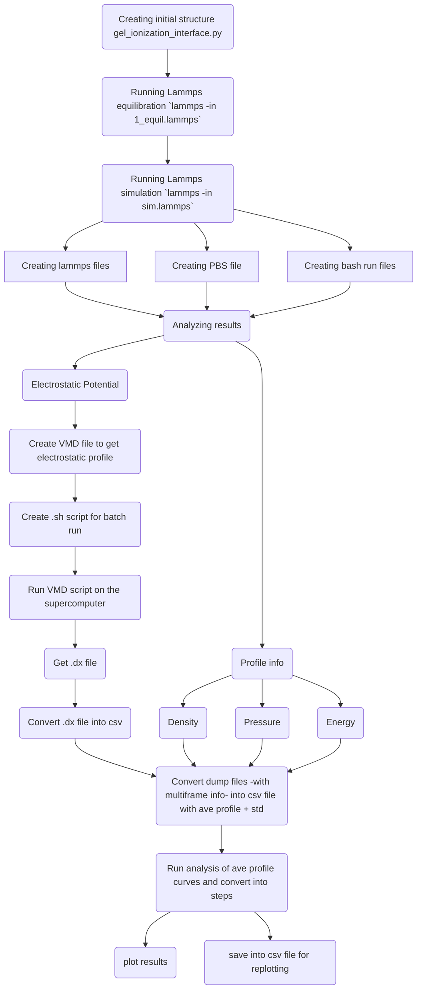

```


```

Here is a sample workflow to get my data points.

Now I will structure all elements of the workflow to optimize into into the best code possible.


```mermaid
graph TD;
    A(Creating initial structure gel_ionization_interface.py)-->B(Analysis of the init. struct. + visualization gel_init_structure_density.py + vmd -e name.vmd);
    B(Running Lammps equilibration `lammps -in 1_equil.lammps`)-->C(Running Lammps simulation `lammps -in sim.lammps` );
    C -->E[Creating lammps files];
    C -->F[Creating PBS file];
    C -->G[Creating bash run files];
    E --> L(Analyzing results);
    F --> L(Analyzing results);
    G --> L(Analyzing results);
    L --> L1(Profile info);
    L --> L2(Electrostatic Potential);
    L2 --> L21(Create VMD file to get electrostatic profile);
    L21 --> L22(Create .sh script for batch run);
    L22 --> L23(Run VMD script on the supercomputer);
    L23 --> L24(Get .dx file);
    L24 --> L25(Convert .dx file into csv);
    L25 --> M;
	L1 --> L11(Density);
	L1 --> L12(Pressure);
	L1 --> L13(Energy);
	L11 --> M(Convert dump files -with multiframe info- into csv file with ave profile + std);
	L12 --> M(Convert dump files -with multiframe info- into csv file with ave profile + std);
	L13 --> M(Convert dump files -with multiframe info- into csv file with ave profile + std);
	M --> M1(Run analysis of ave profile curves and convert into steps);
	M1 --> M11(plot results);
	M1 --> M12(save into csv file for replotting);


    
```